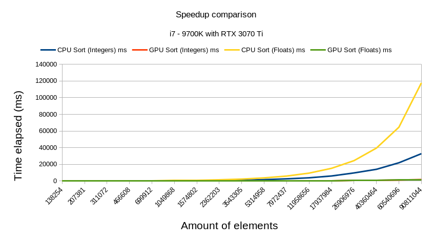

# accel-sort
[](https://badge.fury.io/js/accel-sort)

A high performance sorting library for Javascript. Get up to **70x** speedup when sorting ints and floats



## Prerequisites

- NVIDIA GPU with CUDA Compute Capability (5.0 or higher)
- Node.js (Version 12.x or higher)
- CUDA Version 12.4 installed

## Installation

Run `npm install accel-sort`

## Building from source

Make sure you have `nvcc` installed on your system, then simply run

```shell
npm install
```

## Usage

Simply import the `AccelSort` with the following:

```javascript
const AccelSort = require("accel-sort");
```

Within AccelSort, pass it the specified array types and size to their dedicated functions:

### sortIntegers:
```javascript
let array = new Int32Array([3, 1, 2]);
let buffer = Buffer.from(array.buffer);
AccelSort.sortIntegers(buffer, array.length);
```

### sortFloat:
```javascript
let array = new Float32Array([5.8, -10.7, 1507.6563, 1.0001]);
let buffer = Buffer.from(array.buffer);
AccelSort.sortFloats(buffer, array.length);
```

After that, the original `array` object will be correctly sorted in place

## Contributions

Contributions are welcome! Please submit a pull request or open an issue to discuss proposed changes or additions.

## License

Distributed under the MIT License. See LICENSE for more information.